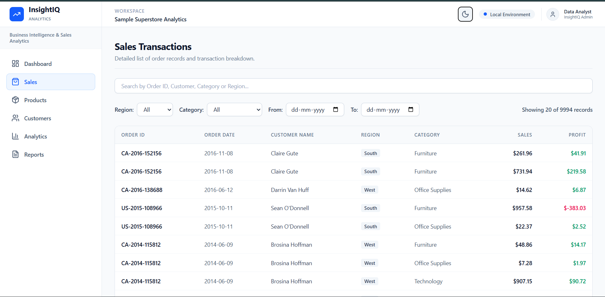
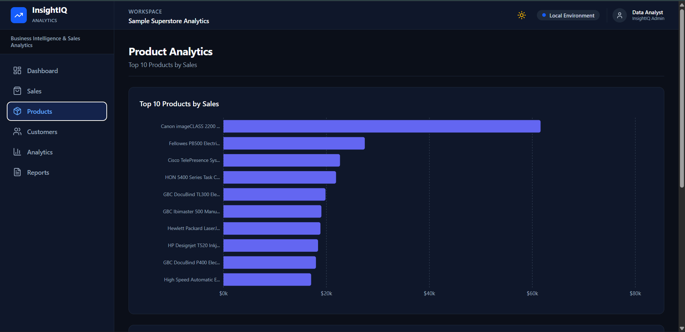

<div align="center">

# 📊 InsightIQ

### Business Intelligence & Sales Analytics Dashboard

A full-stack analytics dashboard for exploring retail sales data, tracking business performance, and generating filtered reports.


**[🌐 Live Demo](https://insightsiq.vercel.app)**

</div>

---

## 📸 Preview

| Dashboard                      | Sales                      |
| ------------------------------ | -------------------------- |
|  |  |

| Products                      | Insights                       |
| ----------------------------- | ------------------------------ |
|  |  |

---

## ✨ Features

* 📊 **Executive Dashboard** — KPIs, sales/profit trends, category and regional analysis
* 🛒 **Sales Analytics** — Search, pagination, region/category filters and date-range filtering
* 📦 **Product & Customer Analytics** — Top rankings with interactive charts and tables
* 💡 **Business Insights** — Automatically identifies key performance highlights
* 📄 **CSV Reports** — Export complete or filtered sales datasets
* 🎨 **Responsive UI** — Mobile-friendly layout with dark/light mode

---

## 🛠 Tech Stack

**Frontend:** React, Vite, Tailwind CSS, Recharts
**Backend:** FastAPI, Python, Pandas
**Data:** Sample Superstore Sales Dataset
**Deployment:** Vercel + Render

---

## 🏗 Architecture

```text
React + Vite
      │
   Fetch API
      │
   FastAPI
      │
Analytics Service
      │
Dataset Loader
      │
Superstore CSV
```

The dataset is loaded once and processed using Pandas, while the frontend communicates with the backend through a centralized API client.

---

## 📁 Structure

```text
InsightIQ/
├── frontend/
│   └── src/
│       ├── components/
│       ├── hooks/
│       ├── pages/
│       └── services/
├── backend/
│   ├── app/
│   │   ├── api/
│   │   ├── data/
│   │   └── services/
│   └── main.py
├── dataset/
└── screenshots/
```

---

## 🚀 Run Locally

```bash
git clone https://github.com/sharma-mohit-codes/InsightsIQ.git
cd InsightsIQ
```

### Backend

```bash
cd backend
pip install -r requirements.txt
uvicorn main:app --reload
```

### Frontend

```bash
cd frontend
npm install
npm run dev
```

Frontend → `http://localhost:5173`
Backend → `http://localhost:8000`
Swagger → `http://localhost:8000/docs`

---

## 🌐 Deployment

**Frontend:** Vercel
**Backend:** Render

The frontend uses `VITE_API_BASE_URL` so the same codebase works for both local development and production.

---

## 👨‍💻 Author

**Mohit Kumar** · B.Tech Information Technology

[GitHub](https://github.com/sharma-mohit-codes)

⭐ If you like the project, consider giving it a star!
