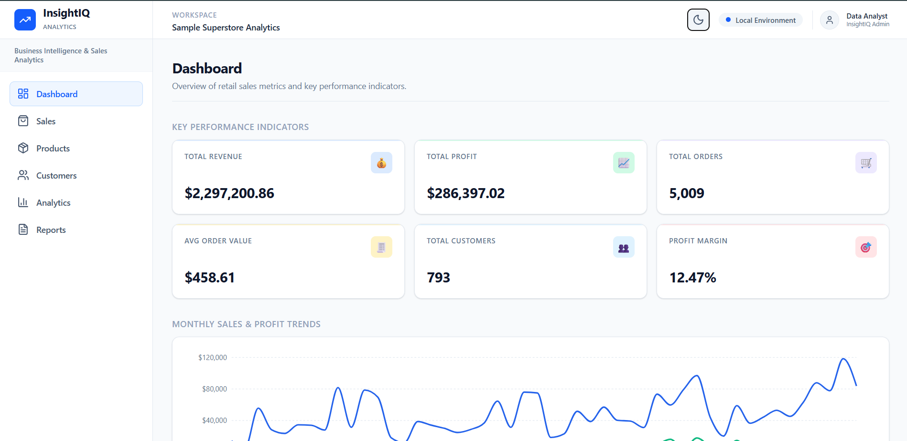
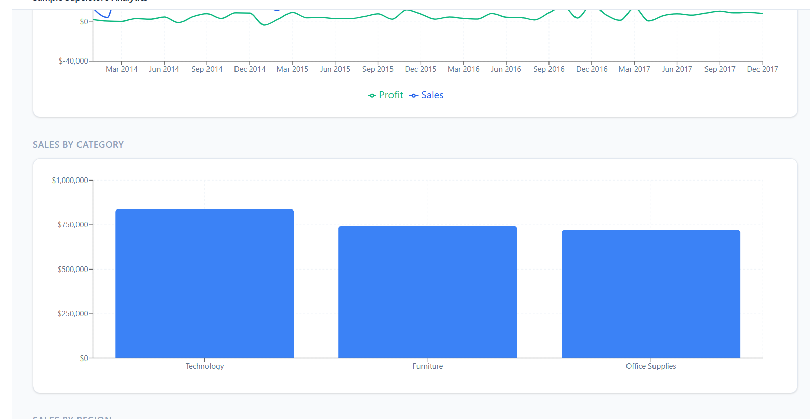
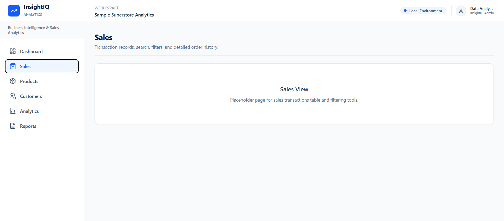
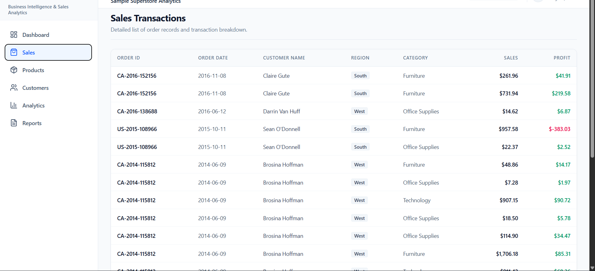

<div align="center">

# 📊 InsightIQ

### Business Intelligence & Sales Analytics Dashboard

Modern full-stack analytics dashboard built using **React, FastAPI, Pandas & SQLite**.


</div>

---

## 📸 Preview

| Dashboard | Analytics |
|------------|-----------|
|  |  |

| Sales | Paginated Sales |
|-------|-----------------|
|  |  |

---

## ✨ Features

### 📊 Dashboard
- KPI Cards
- Monthly Sales & Profit Trend
- Category Breakdown
- Regional Distribution

### 🛒 Sales Module
- Paginated Transactions
- Server-side Pagination
- Server-side Region & Category Filters

### 🚧 Coming Soon
- Search
- Sorting
- Product Analytics
- Customer Analytics
- Business Insights
- CSV Report Export

---

## 🏗 Architecture

```text
React + Vite
      │
Native Fetch API
      │
FastAPI
      │
Analytics Service
      │
Dataset Loader
      │
CSV Dataset
```

---

## 🛠 Tech Stack

| Frontend | Backend | Data | Charts |
|----------|----------|------|---------|
| React + Vite | FastAPI | Pandas + SQLite | Recharts |

---

## 📁 Project Structure

```text
InsightIQ
│
├── frontend
│   ├── components
│   ├── hooks
│   ├── layouts
│   ├── pages
│   ├── services
│   └── utils
│
├── backend
│   ├── api
│   ├── core
│   ├── data
│   ├── services
│   ├── models
│   └── schemas
│
├── dataset
├── screenshots
└── README.md
```

---

## 📊 Dataset

**Sample Superstore Sales Dataset**

- ~9,994 Transactions
- 21 Attributes
- 4 Years of Retail Sales Data

---

## 🔌 API Endpoints

| Endpoint | Description |
|----------|-------------|
| `/analytics/kpis` | KPI Summary |
| `/analytics/trends` | Monthly Trends |
| `/analytics/categories` | Category Analytics |
| `/analytics/regions` | Region Analytics |
| `/sales` | Paginated Sales Records |

---

## 🚀 Run Locally

### Backend

```bash
cd backend
pip install -r requirements.txt
uvicorn main:app --reload
```

### Frontend

```bash
cd frontend
npm install
npm run dev
```

Backend → `http://localhost:8000`

Swagger → `http://localhost:8000/docs`

Frontend → `http://localhost:5173`

---

## 📈 Progress

| Module | Status |
|---------|--------|
| Dashboard | ✅ Complete |
| Sales | 🚧 In Progress |
| Products | ⏳ Planned |
| Customers | ⏳ Planned |
| Insights | ⏳ Planned |
| Reports | ⏳ Planned |

---

## 🗺 Roadmap

- [x] KPI Dashboard
- [x] Interactive Charts
- [x] Sales Pagination
- [x] Server-side Filtering
- [ ] Search
- [ ] Sorting
- [ ] Product Analytics
- [ ] Customer Analytics
- [ ] Reports Export
- [ ] Deployment

---

## 👨‍💻 Author

**Mohit Kumar**

B.Tech Information Technology

---

⭐ If you found this project useful, consider giving it a star!